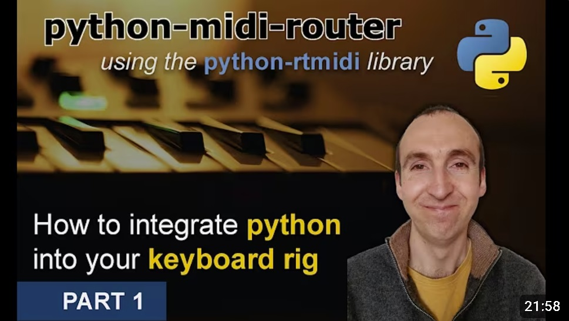

# Python Midi Router

This repo contains the code that was developed as part of a 4-part YouTube tutorial series showing how to make a midi router with Python (using the python-rtmidi library).

The tutorials are aimed at musicians (rather than programmers), so in case you are not familiar with GitHub, you can view the code by:

- clicking on the **Youtube Tutorial** directory above, then
- clicking on the relevant **Python file** in that directory

Feel free to copy (CTRL+C) and paste (CTRL+V) the code into your own python file.

# Links to YouTube Videos

- Part 1: https://www.youtube.com/watch?v=maZnBR4PYds
- Part 2: https://www.youtube.com/watch?v=5PIRYw47DHw
- Part 3: https://www.youtube.com/watch?v=yycrtI7Xl1M
- Part 4: https://www.youtube.com/watch?v=3SS6EW9pPAc